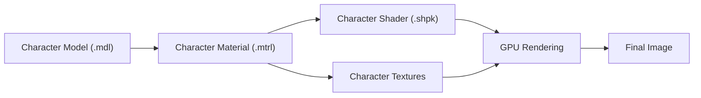
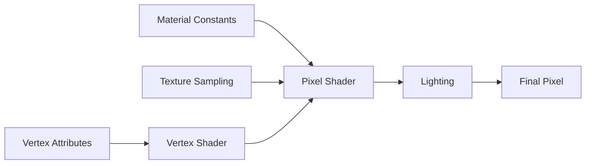
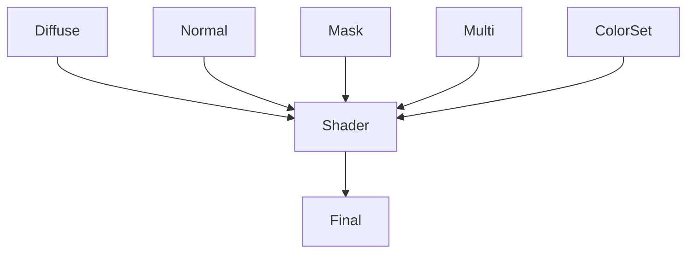
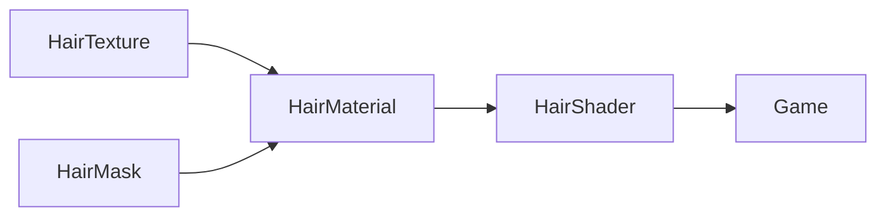

# Character Shader（角色 Shader）

> 本章节介绍 FFXIV 中用于角色渲染的 Shader，包括玩家角色（Player Character）、NPC、部分人形敌人与相关对象所使用的 Shader。

---

## 什么是 Character Shader？

Character Shader 是 FFXIV 中最常见的一类 Shader。

它负责渲染玩家角色的大部分可见对象，包括：

- 身体（Body）
- 面部（Face）
- 头发（Hair）
- 眼睛（Eyes）
- 装备（部分）
- 配件（Accessory）

Character Shader 的设计目标是在保证性能的前提下，实现角色所需的各种材质效果，例如：

- 光照（Lighting）
- 法线贴图（Normal Mapping）
- 染色（Dye）
- 高光（Specular）
- 自发光（Emission）
- 半透明（Transparency）
- 环境光遮蔽（Ambient Occlusion）

对于绝大多数角色 Mod 而言，Character Shader 是最重要的 Shader 类型。

---

## Character Shader 在渲染流程中的位置



Character Shader 并不会直接读取模型。

真正负责连接模型、纹理与 Shader 的，是对应的 Material（`.mtrl`）。

---

## Character Shader 的组成

一个 Character Shader 通常包含以下几个部分。

| 组成 | 说明 |
|------|------|
| Shader Package (.shpk) | Shader 程序本体 |
| Shader Keys | 控制功能开关 |
| Material Constants | 控制浮点参数 |
| Samplers | 定义纹理输入 |
| Vertex Attributes | 接收模型顶点数据 |

这些部分共同决定最终渲染效果。

---

## Character Shader 常用纹理

不同 Shader 使用的纹理数量可能不同，但通常包括以下几类。

| Texture Slot | 常见用途 | 常见称呼 |
|--------------|----------|---------|
| Diffuse | 基础颜色（Albedo） | 漫反射/颜色贴图 |
| Normal | 法线信息 | 法线 |
| Mask | 材质控制 | 遮罩 |
| Multi | 多用途纹理 | / |
| Color Set | 染色控制 | / |
| Catchlight | 眼睛高光（部分 Shader） | / |

具体使用哪些纹理，仍取决于 Shader 自身的实现。

---

## Character Shader 常见功能

Character Shader 通常支持以下功能。

| 功能 | 说明 |
|------|------|
| Dye | 装备染色 |
| Normal Mapping | 法线贴图 |
| Specular | 高光计算 |
| Emissive | 自发光 |
| Alpha Test | Alpha 裁剪 |
| Transparency | 半透明 |
| Skin Lighting | 皮肤光照 |
| Eye Highlight | 眼睛高光 |
| Rim Lighting | 边缘光（部分 Shader） |

并非所有 Character Shader 都支持上述全部功能。

---

## Character Shader 分类

为了方便理解，本 Wiki 按照渲染对象进行分类。

| 分类 | 用途 |
|------|------|
| Face Shader | 面部 |
| Hair Shader | 头发 |
| Eye Shader | 眼睛 |
| Body Shader | 身体 |
| Equipment Shader | 装备 |
| Accessory Shader | 饰品 |

后续章节将分别介绍这些 Shader。

---

## 常见 Character Shader

下表列出了游戏中常见的 Character Shader。

| Shader | 主要用途 | 备注 |
|---------|----------|------|
| （待补充） | | |

> 本表将在后续章节持续完善。

---

## Character Shader 与 Material 的关系

Character Shader 本身并不保存任何材质数据。

真正决定渲染结果的是 Material（`.mtrl`）。

可以理解为：

```text
Shader
│
├── 定义可以做什么
│
Material
│
├── 决定实际使用什么
│
Texture
│
└── 提供实际图像数据
```

同一个 Character Shader 可以对应多个 Material。

因此，即使 Shader 相同，不同 Material 仍可能表现出完全不同的视觉效果。

---

## 社区经验

### 修改 Texture 后没有变化

优先检查：

- Material 是否绑定了正确纹理
- Sampler 是否对应正确 Texture Slot
- Penumbra 是否重新加载
- TexTools 是否重新导入

---

### 修改 Material Constant 无效果

通常说明：

- 当前 Shader 没有读取该 Constant
- Shader Key 未启用对应功能
- Material 使用了其他分支
- Shader 本身未实现对应逻辑

---

### 为什么同一个 Shader 渲染效果不同？

Shader 只负责提供计算方式。

真正影响最终效果的还有：

- Material
- Shader Keys
- Material Constants
- Texture
- Vertex Color
- Color Set

因此，不能仅根据 Shader 名称判断最终渲染结果。

---

## 延伸阅读

建议继续阅读：

- Face Shader
- Hair Shader
- Eye Shader
- Material（MTRL）
- Shader Keys
- Material Constants

---

## 工作原理（How It Works）

Character Shader 的执行流程可以概括为以下几个阶段：



在 GPU 中，一个 Character Shader 并不是一次性完成所有工作。

通常可以分为两个主要阶段：

- Vertex Shader（顶点阶段）
- Pixel Shader（像素阶段）

Vertex Shader 负责处理模型顶点。

Pixel Shader 则负责计算每一个像素最终显示的颜色。

---

## Texture Sampling（纹理采样）

Character Shader 会从多个 Texture Slot 中读取数据。

一个典型流程如下：



不同 Shader 所读取的 Texture Slot 并不完全一致。

某些 Shader 甚至不会使用 Multi 或 Color Set。

因此，在修改贴图之前，应先确认当前 Shader 的纹理需求。

---

## 实际案例：修改头发颜色

目标：

修改角色头发的材质表现。

需要修改：

- **Hair Shader**
- Hair Material
- Hair Normal
- Hair Mask

无需修改：

- Face Shader
- Eye Shader
- Skin Shader

最终流程：



## Community Notes

### 为什么 Character Shader 看起来没有变化？

检查：

□ 是否 Reload Penumbra

□ 是否重新生成 MTRL

□ Shader 是否支持该 Constant

□ Shader Key 是否开启

□ 是否导入正确 Texture

---

### 为什么头发法线无效？

通常原因：

- Hair Shader 未读取 Normal

- Alpha Channel 被覆盖

- Mask 覆盖 Specular

- 面朝向错误

---

### 为什么我的脸会发光？

通常因为：
Emission Constant 或 Mask Alpha被错误修改。
