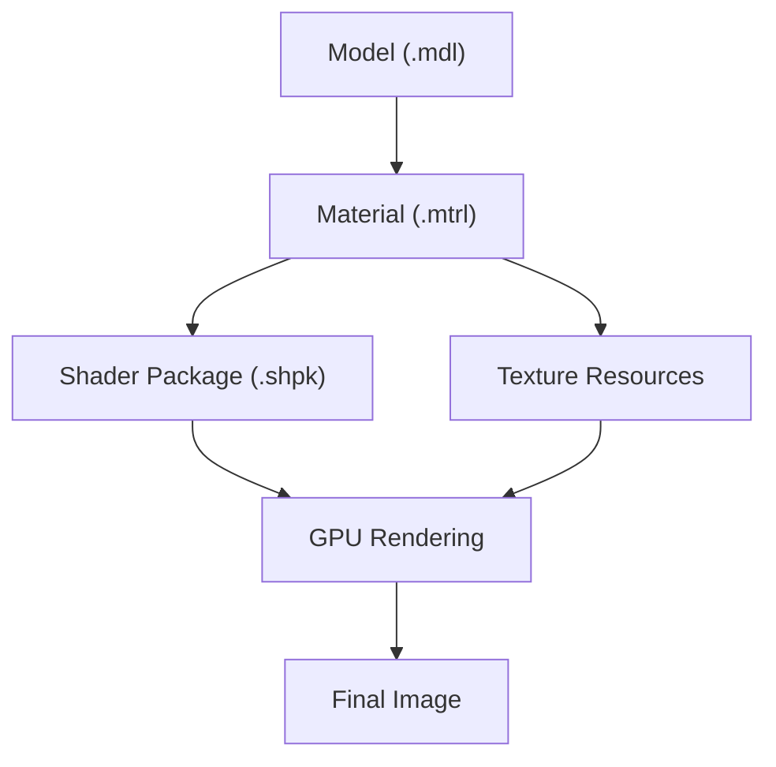
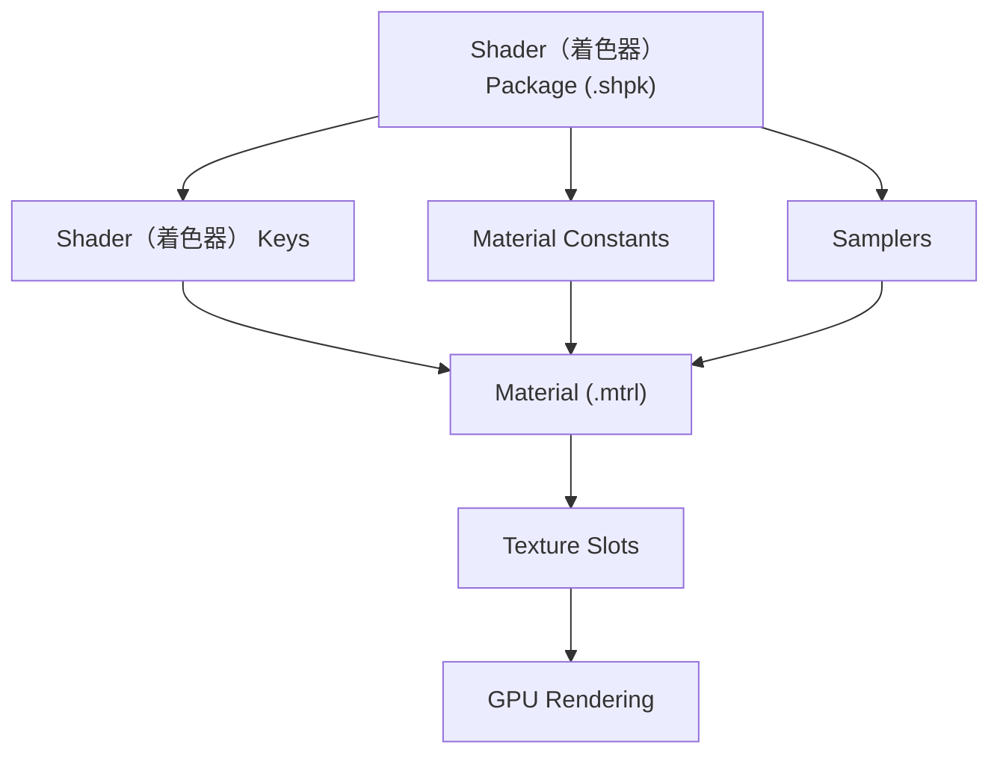
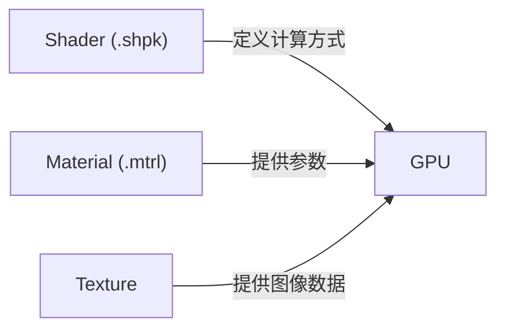

# ShaderReference（着色器参考）

## 什么是 Shader（着色器）？

Shader（着色器）是 FFXIV 图形渲染流程中的核心程序。

它决定了模型在游戏中的最终显示效果，包括：

- 光照计算
- 法线计算
- 材质表现
- 半透明效果
- 发光（Emission）
- 染色（Dye）
- 阴影
- 环境光（Ambient）

游戏中的每一个模型都会通过指定的 Shader（着色器） 完成最终渲染。

---

## Shader（着色器） 在 FFXIV 中的位置

一个角色模型的大致渲染流程如下：

```text
Model (.mdl)
        │
        ▼
Material (.mtrl)
        │
        ▼
ShaderPackage (.shpk)
        │
        ▼
Texture
        │
        ▼
GPU
        │
        ▼
最终画面
```

Shader（着色器） 本身并不会保存纹理。

真正决定使用哪些 Texture 的，是 MTRL 文件。

Shader（着色器） 负责告诉 GPU：

- 如何读取纹理
- 如何组合纹理
- 如何计算颜色
- 如何输出最终像素

## Shader 在渲染流程中的位置

Shader 并不是独立工作的，它位于整个模型渲染流程的中间。

下面的流程图展示了 FFXIV 中一个模型从资源文件到最终显示在屏幕上的基本过程。



在这一过程中：

- **Model (.mdl)** 定义模型几何结构与顶点数据。
- **Material (.mtrl)** 指定使用哪个 Shader，并绑定各种参数与纹理。
- **Shader Package (.shpk)** 定义 GPU 如何进行渲染计算。
- **Texture Resources** 提供渲染所需的图像数据。
- **GPU Rendering** 根据 Shader 和 Material 完成最终计算。
- **Final Image** 为最终显示在游戏中的画面。

---

## Shader（着色器） 的内部组成

一个 Shader（着色器） 并不是单独工作的。

真正参与渲染的还有 Shader（着色器） Key、Material Constant、Sampler 等数据。



## Shader、Material 与 Texture 的关系

很多初学者都会混淆这三者的职责。

实际上，它们分别负责完全不同的工作。



三者的关系可以概括如下：

| 对象 | 主要职责 |
|------|-----------|
| Shader | 定义渲染算法（How） |
| Material（MTRL） | 配置 Shader 参数（Configuration） |
| Texture | 提供图像数据（Data） |

可以用一个简单的比喻理解：

| 类比 | 对应关系 |
|------|-----------|
| 菜谱 | Shader |
| 调料配方 | Material |
| 食材 | Texture |

Shader 告诉 GPU **应该怎样计算**。

Material 告诉 Shader **应该使用哪些参数**。

Texture 则提供 **真正参与计算的数据**。

---

## Shader（着色器） 分类

FFXIV 的 Shader（着色器） 大致可以分为以下几类：

| 分类 | 用途 |
|------|------|
| Character Shader（着色器） | 玩家角色与 NPC |
| Equipment Shader（着色器） | 装备 |
| Hair Shader（着色器） | 头发 |
| Face Shader（着色器） | 面部 |
| Skin Shader（着色器） | 皮肤 |
| Eye Shader（着色器） | 眼睛 |
| Weapon Shader（着色器） | 武器 |
| Monster Shader（着色器） | 怪物 |
| Environment Shader（着色器） | 场景 |
| UI Shader（着色器） | 用户界面 |

不同 Shader（着色器） 使用的 Texture Slot、Material Constant 与 Shader（着色器） Key 并不完全相同。

---

## Dawntrail（7.x）变化

随着 Dawntrail 图形更新，Square Enix 对大量 Shader（着色器） 进行了调整。

主要包括：

- 新增 Material Constant
- Shader（着色器） Key 更新
- 光照计算优化
- PBR 表现增强
- 材质参数重新组织

因此，6.x 与 7.x 的 Shader（着色器） 配置不能完全互换。

本 Wiki 默认以 Dawntrail（7.x）版本为参考。

---

## 阅读建议

建议按以下顺序阅读本 Wiki：

1. Shader Reference（当前章节）
2. Character Shader（最常用着色器）
3. 其他shaders章节
4. Material（MTRL）
5. Texture
6. Workflow

这样可以建立完整的mod工作流程理解。